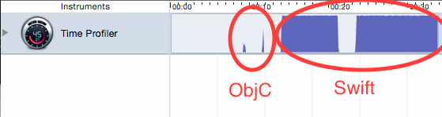
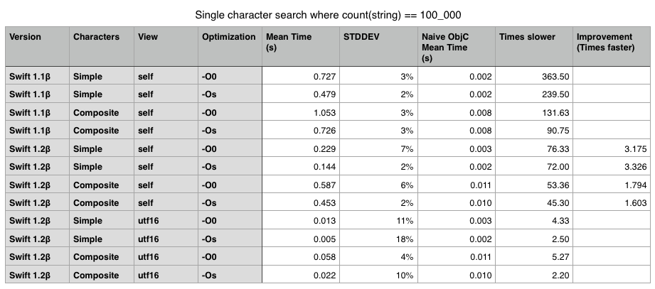

Simple Swift.String Performance Test
====================================

This is a basic performance test comparing iteration through a string in Swift and Objective-C.  With regards to complex Unicode characters, one would
not expect a perfect apples-to-apples comparison since Objective-C returns
`unichar` elements and Swift returns composed characters with possible heap
usage in complex cases.  That said, ASCII representable characters should have
a similar footprint.

The results in Swift 1 were terrifying.  They've gotten a lot better.

Highlights
----------

- Swift 1.1 string searching was up to 363 times slower than Objective-C, making basically unusable for any sort of string processing.  A lot of that had to do with retaining and releasing on each iteration.  This as even worse in debug builds.
- Swift 1.2 got it down to 76 times slower than Objective-C, still painfully slow.  I also discovered (or they added?) the utf16 view, which provided relatively raw access to the native data structure.  This was only about twice as slow in release builds.
- Swift 2.0 didn't improve character iteration, but improved performance on debug build utf16 views.
- Swift 3.0 improved performance a bit.
- Swift 4.0 improved everything, a lot.  The biggest impact was on iterating over simple characters, which is now just 2.5 times slower than Objective-C.

Latest: Testing in Xcode 9.1
----------------------------

Swift strings have continued to get faster over every release and Swift 4 is no exception.  Comparing Swift 4.0 to Swift 3.0 beta, the biggest improvement was with simple strings, those containing a simple latin alphabet, possibly up to those fitting in a single unichar.  Iterating through those is 18 times faster than it was, and less than three times slower than Objective-C.  The speeds are actually on par with what you'd get from the utf16 view in Swift 3.

Composite characters are still much slower to iterate through but only about 12 times slower than Objective-C.

The utf16 view is now only about 40% slower than Objective-C, which is a very reasonable amount of overhead.

Older: Testing in Xcode 6.3β
-----------------------------

Xcode 6.3 (and Swift 1.2) has seen a substantial improvement in character iteration
and comparison, clocking in at about 3.3x faster for the ASCII representable search
and 1.6x faster for composite character search.  This performance improvement applies 
to both -O0 and -Os builds so you will actually see new -O0 builds running faster than 
previous -Os builds.

While these results are a significant improvement, the tests are still 45 to 72 times 
than the naive UTF16 test done in Objective-C, making it too slow for certain text 
processing applications that don't need full Unicode support or can implement their 
own seeking logic to advance through composite characters.  For these cases, Swift's 
`String.utf16` view provides a significantly faster search time, only abouty 2.2 times 
slower than the Objective-C equivalent (see results above):

    // Example from test, searching string for "~"
    
    let reference = first("~".utf16)!
    for char in text.utf16 {
        if char == reference {
            println(char)
        }
    }

**Note:** For simpler applications there are a variety of built-in search functions that 
are incredibly performant.  I'm not looking at those directly because I am more interested 
in whether or not fast String operations can be written *in Swift* using the provided APIs.
This interest stems out of a CommonMark implementation I wrote using String and Character 
which was unbearably slow.

Older: Testing in Xcode 6.1β
----------------------------

Iterating over 100,000 ASCII-representable characters and comparing to an
ASCII-representable character:

|       |Swift [-O0] | Swift [-Os] | Objective-C [-O0] |
|-------|------------|-------------|-------------------|
| Time  | 0.727s     | 0.479s      | 0.002s            |
| STDEV | 3%         | 2%          | 13%               |

Iterating over 100,000 composite characters and comparing to a single
ASCII-representable character has an interesting result:

|       |Swift [-O0] | Swift [-Os] | Objective-C [-O0] |
|-------|------------|-------------|-------------------|
| Time  | 1.053s     | 0.726s      | 0.008s            |
| STDEV | 3%         | 3%          | 14%               |

The Objective-C result is expected as I went from 100,000 to 425,000 unichars
but Swift's costs did not scale nearly as much, meaning the internal work of
composing characters (and even heap allocating 25% of them) offloaded some of
the other costs.

Profile is included but some highlights (just from looking in the middle of the
ASCII Swift peak):

- Lots (15.4%) of retaining and releasing of CFStrings even in ASCII case
  (resulting in a lot of atomic testing).
- Lots (9.8%) of message sending.  In `Character.init`, in
  `<Character,Character>==`
- Lots (10.4%) of Swift retaining and releasing.
- Many other things.  In my inverted call tree over a partial range, there are
  over a 100 functions whose individual running times exceed the Objective-C
  version.
